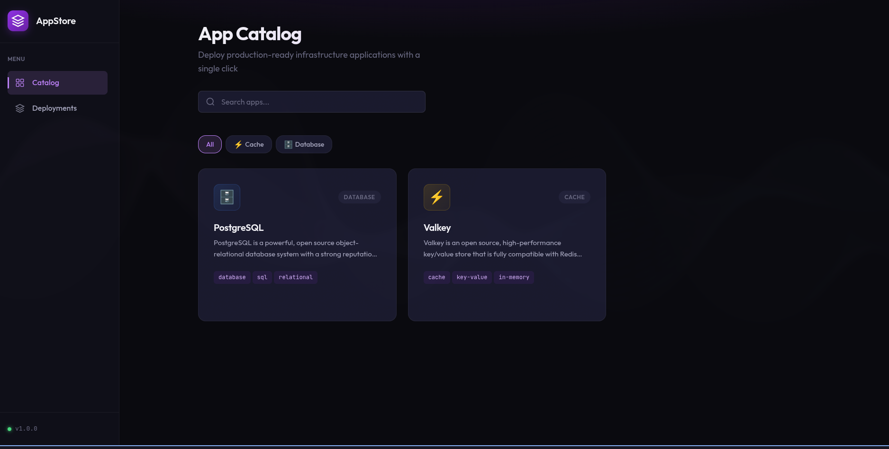
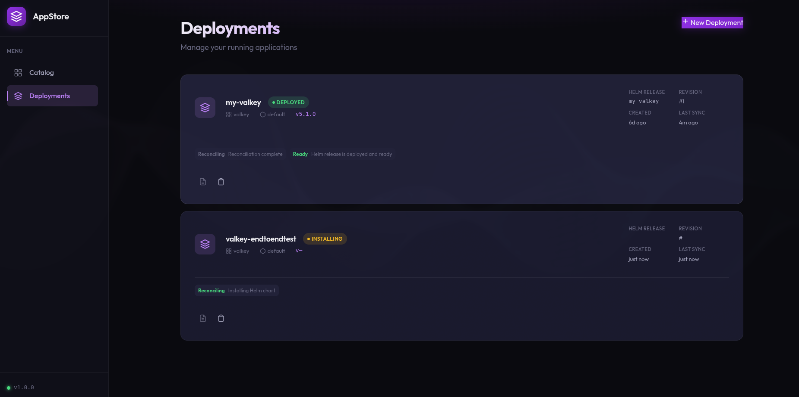
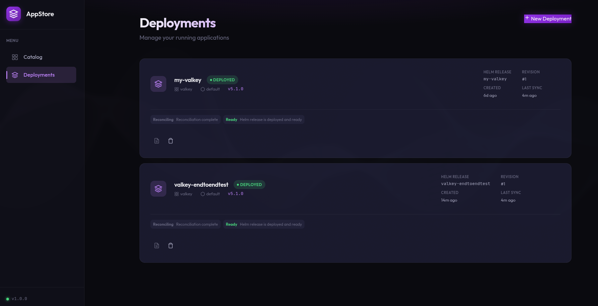

# Kubernetes App Store

A self-service platform for deploying infrastructure applications on Kubernetes. Teams can browse a catalog of pre-configured apps (PostgreSQL, Valkey, etc.) and deploy them with a single click.

## Screenshots

### App Catalog
Browse available infrastructure apps with search and category filters.



### Deployment in Progress
Real-time status updates as your application deploys.



### Deployment Complete
View deployed applications with status, version, and Helm release details.



## Architecture

```
┌─────────────┐     ┌─────────────┐     ┌──────────┐     ┌──────────┐     ┌─────────┐
│   Svelte    │────▶│  Go Backend │────▶│ RabbitMQ │────▶│ Operator │────▶│  Helm   │
│  Frontend   │     │     API     │     │          │     │          │     │ Release │
└─────────────┘     └─────────────┘     └──────────┘     └──────────┘     └─────────┘
                           │                                   │
                           │            ┌──────────┐           │
                           └───────────▶│   K8s    │◀──────────┘
                              (query)   │   API    │   (CRD)
                                        └──────────┘
```

**Flow:**
1. User selects an app from the catalog in the frontend
2. Backend API publishes a deployment request to RabbitMQ
3. Operator consumes the message and creates an `AppDeployment` CRD
4. Operator reconciles the CRD by installing/upgrading the Helm chart
5. Backend queries Kubernetes for deployment status

## Components

| Directory | Description |
|-----------|-------------|
| `operator/` | Kubernetes Operator (Go + Kubebuilder) - watches AppDeployment CRDs and manages Helm releases |
| `backend/` | REST API (Go + net/http) - serves catalog, handles deployment requests |
| `frontend/` | Web UI (SvelteKit) - catalog browser and deployment management |
| `charts/` | App catalog definition and Helm charts |
| `deploy/` | Kubernetes manifests for deploying the platform |

## Prerequisites

- Kubernetes cluster (v1.28+)
- kubectl configured
- Go 1.22+
- Node.js 20+ (for frontend)
- Docker (for building images)

## Quick Start

### 1. Deploy the Operator

```bash
cd operator
make docker-build docker-push IMG=ghcr.io/stijoh/appstore-operator:latest
make deploy IMG=ghcr.io/stijoh/appstore-operator:latest
```

### 2. Deploy RabbitMQ

```bash
kubectl apply -f deploy/rabbitmq.yaml
```

### 3. Run the Backend

```bash
cd backend

# Port-forward RabbitMQ (if running in-cluster)
kubectl port-forward -n rabbitmq svc/rabbitmq 5672:5672 &

# Run the server
go run ./cmd/server/main.go -catalog-path ../charts/catalog.yaml
```

### 4. Test the API

```bash
# List available apps
curl http://localhost:8080/api/v1/catalog

# Get app details
curl http://localhost:8080/api/v1/catalog/postgresql

# List deployments
curl http://localhost:8080/api/v1/deployments

# Create a deployment
curl -X POST http://localhost:8080/api/v1/deployments \
  -H "Content-Type: application/json" \
  -d '{"appName": "valkey", "namespace": "default"}'
```

## API Endpoints

| Method | Endpoint | Description |
|--------|----------|-------------|
| GET | `/api/v1/catalog` | List all available apps |
| GET | `/api/v1/catalog/{appName}` | Get app details |
| GET | `/api/v1/deployments` | List all deployments |
| GET | `/api/v1/deployments/{name}` | Get deployment details |
| POST | `/api/v1/deployments` | Create a new deployment |
| PUT | `/api/v1/deployments/{name}` | Update a deployment |
| DELETE | `/api/v1/deployments/{name}` | Delete a deployment |

## Custom Resource Definition

The operator watches `AppDeployment` resources:

```yaml
apiVersion: appstore.bitpipe.no/v1alpha1
kind: AppDeployment
metadata:
  name: my-valkey
  namespace: default
spec:
  appName: valkey
  teamId: team-alpha
  requestedBy: user@example.com
  values:
    master:
      persistence:
        size: 1Gi
status:
  phase: Deployed
  helmReleaseName: my-valkey
  helmReleaseRevision: 1
  deployedChartVersion: 5.1.0
```

## Available Apps

| App | Category | Description |
|-----|----------|-------------|
| PostgreSQL | Database | Open source relational database |
| Valkey | Cache | Redis-compatible key/value store |

## Development

### Local Development with Docker Compose

```bash
# Start RabbitMQ locally
docker-compose up -d

# Run backend
cd backend && go run ./cmd/server/main.go

# Run frontend (when implemented)
cd frontend && npm run dev
```

### Building the Operator

```bash
cd operator
make generate       # Generate CRD manifests
make manifests      # Generate RBAC and CRD YAML
make build          # Build the binary
make docker-build   # Build container image
```

## Project Status

- [x] Phase 1: Operator Foundation - Helm chart deployment via CRDs
- [x] Phase 2: RabbitMQ Integration - Async message-based deployment
- [x] Phase 3: Catalog Service & K8s Queries - REST API for catalog and deployments
- [x] Phase 4: Svelte Frontend - Web UI with dark mode
- [ ] Phase 5: Authentication - Keycloak integration

## License

MIT
